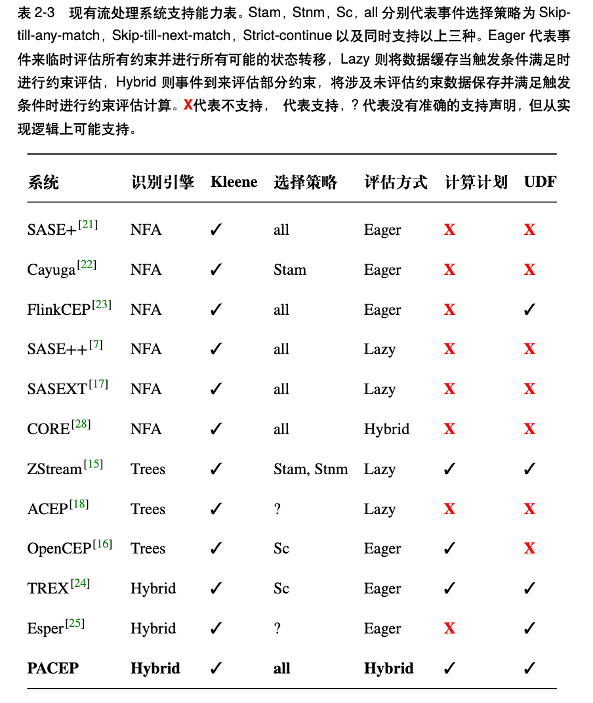

<div align="center">
  
  <h1>Postpone Accelerate Complex Event Processing</h1>
</div>

[中文文档](README.zh.md) | [English](README.md)

Postpone Accelerate Complex Event Processing (PACEP) is a hybrid two-phase recognition engine combining automata with tree models, designed to address the dual challenges of state space explosion and inefficient constraint evaluation in traditional approaches under multi-Kleene closure scenarios.

# Introduction
Complex Event Recognition (CER) is a technique for extracting event sequences matching domain-expert-defined patterns from real-time data streams. Guided by domain knowledge, CER systems identify and extract critical event sequences through pattern matching, where patterns typically incorporate type constraints, temporal characteristics, and predicate restrictions.

As IoT rapidly evolves and sensor deployment proliferates, stream processing engines can efficiently ingest comprehensive, low-latency real-time data streams for risk identification scenarios. Leveraging expert-defined patterns, these engines identify event sequences meeting high-risk criteria. For instance, in maritime safety and healthcare systems, they capture potentially dangerous event sequences for timely emergency response planning.

Dangerous events typically develop through sequential phases: instantaneous phases (single-event triggers) and interval phases (bounded sub-event sequences). Instantaneous phase recognition only evaluates event types and values against patterns, while interval phase recognition (with uncertain start/end times and durations) incurs computational costs scaling polynomially or exponentially with related event types.

## Classic Cases
### Human-Triggered Stock Price Flash Crash
In modern finance, a flash crash refers to a rapid, deep, and volatile drop in security prices within a very short time, followed by a quick recovery. Human-triggered flash crashes often occur when market participants deliberately induce panic through "flash attacks." For example, manipulators might create a false supply-demand illusion with large volumes of fake orders (like "spoofing" or "iceberg orders"), misleading other investors and exacerbating the crash.

```sql
PATTERN SEQ(a+, b, c)
        SEMATIC skip_till_any_match
        WHERE a.type = 'close'
        AND msd_exceeds_variance_threshold(a) >= 0.1
        AND b.type = 'high'
        AND b.value - min(a) < 0
        AND c.type = 'low'
        AND c.value - 0.9 * b.value <= 0
        AND c.value - max(a) >= 0
        WITHIN 7 days 
```
### Anomalous Load in Hadoop Clusters
Cluster computing is widely used in big data analytics, making cluster monitoring (like Hadoop clusters) crucial for understanding performance issues and managing resources. Popular tools like Ganglia provide system metrics (CPU, memory, I/O) from external user programs. However, as demand grows, associating these metrics with workload-specific logs (like Hadoop task start, progress, and end) becomes essential for identifying imbalanced workloads, task lags, and data queuing issues. Manually programming these tasks is cumbersome and non-reusable.
In scenarios like identifying reducers causing load imbalance in distributed clusters, declarative pattern queries become key to freeing users from manual programming. Many monitoring queries require associating a series of events (using Kleene closure), which may span single or multiple traces from different machines. Processing these queries is crucial for real-time cluster monitoring amid massive system trace data generation.

```sql
PATTERN SEQ(a, b+, c)
        SEMATIC skip_till_any_match
        WHERE a.type = 'reducer_start'
        AND b.type = 'load_std'
        AND b[i].value - b[i-1].value >= 0
        AND c.type = 'reducer_end'
        WITHIN 10 minutes 
```
### Stock Correlation Recognition
In financial market analysis, studying stock correlations provides valuable decision-making insights for investors. Particularly within the same industry, companies often exhibit correlated stock price movements. For instance, Microsoft (MSFT) and Google (GOOG), as globally recognized tech giants, are influenced by similar market factors like industry trends, policy changes, and economic cycles.

```sql
PATTERN SEQ(a+, b+)
        SEMATIC skip_till_any_match
        WHERE a.type = 'goog'
        AND a[i].value - a[i-1].value >= 0
        AND last(a) - 1.1 * first(a) >= 0
        AND b.type = 'msft'
        AND b[i].value - b[i-1].value >= 0
        AND last(b).value / first(b).value >= last(a).value  
            / first(a).value 
        WITHIN 7 days
```
### LNG-Rollover Detection
LNG-Rollover refers to the physical mixing process between two or more different components of liquefied natural gas (LNG) within a tank. By detecting trends in evaporation rates, density differences between layered pages, and tank pressure changes, potential LNG Rollover events can be identified in advance. For example, Figure 1-1 illustrates four stages of LNG Rollover, where the second stage can be captured by recognizing a rapid change trend in evaporation rate (event A), followed by two adjacent density difference decreasing trends (event B), providing sufficient precursor information for LNG Rollover. However, not all LNG Rollover events require attention. As shown in Figure 1-2, only Rollover 3 and Rollover 4, which exceed tank safety limits and develop rapidly over time leading to severe consequences, need to trigger alarms. Event C represents tank pressure exceeding safety thresholds.
<div align="center">
  
  
</div>

## How It Works
### Solving State Space Explosion
Kleene closure operators cause state space explosions that increase latency. PACEP merges intermediate matches differing only in Kleene states, generating minimal satisfying supersets while preserving solution completeness. Through event-type partitioning and mathematical proof, PACEP reduces state space complexity from exponential to polynomial.

### Efficient Constraint Evaluation
PACEP partitions patterns into:
1. Basic pattern recognition to identify temporal anchors
2. Solution expansion to construct final matches

During expansion:
- Calculates constraint evaluation costs
- Prioritizes low-cost constraints for early pruning
- Combines captured Kleene events only once
- Computes shared functions once (CC-Once principle)
- Uses pseudo-tables to store intermediate results
- This dual-phase approach eliminates redundant computation.

## Experimental Results
### Related Work
Here's the professional translation with domain-specific terminology and technical accuracy:
We analyze the characteristics of mainstream systems across five key dimensions:
- Engine Type
- Capability in Event Selection Policy (S.P.)
- Constraint Evaluation Approach (EV)
- Evaluation Plan Formulation (E.P.)
- User-Defined Function (UDF) Support
<div align="center">
  
</div>
Kleene states capture temporally bounded yet potentially infinite sub-event sequences. The engine type determines an engine's methodology for capturing pattern-conforming event sequences from real-time data streams. The event selection policy defines the engine's response when incoming events either satisfy or violate pattern-matching conditions. The constraint evaluation approach governs whether constraints are computed immediately upon event arrival. The evaluation plan optimizes overall recognition efficiency by strategically sequencing constraint evaluation in a temporal order different from the original pattern definition.

### Performance Evaluation
-[Compare with CORE/SASE/CET] (https://github.com/KyraStyl/SASEXT)

-[Compare with FLINKCEP] (https://github.com/LiLiJacky/PACEP_FLINKCEP)

## Conclusion
PACEP ensures polynomial-time complexity during automata-based pattern recognition and eliminates redundant computation during solution expansion. It also supports custom UDFs for incremental constraint evaluation acceleration.

# How to Run the Code
1. Install dependencies
```python
pip install -r requirements.txt
```
2. Register UDFs in ./factories
3. Create pattern scripts (e.g., ./experiments/effective/lng_rollover.py)
4. Execute
```python
python ./lng_rollover.py
```
5. Results appear in ./outputs

# Acknowledgements
This work is supported by Projects of International Cooperation and Exchanges NSFC-DFG (Grant No. 62061136006).
