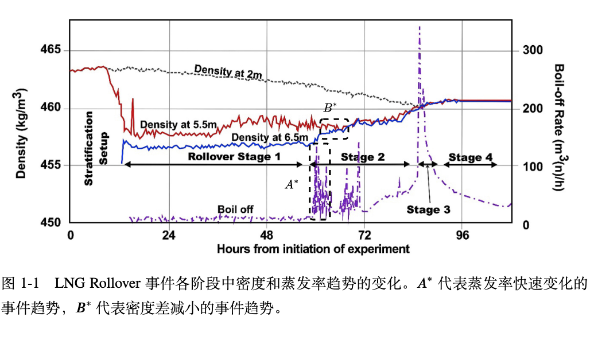
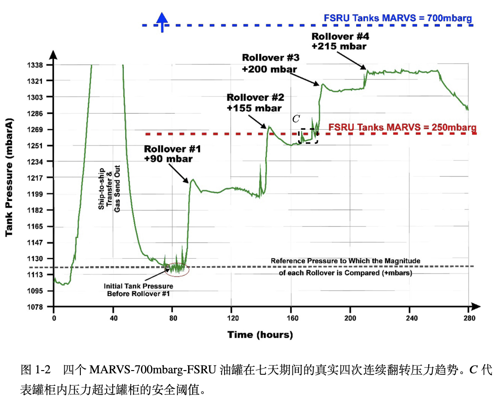
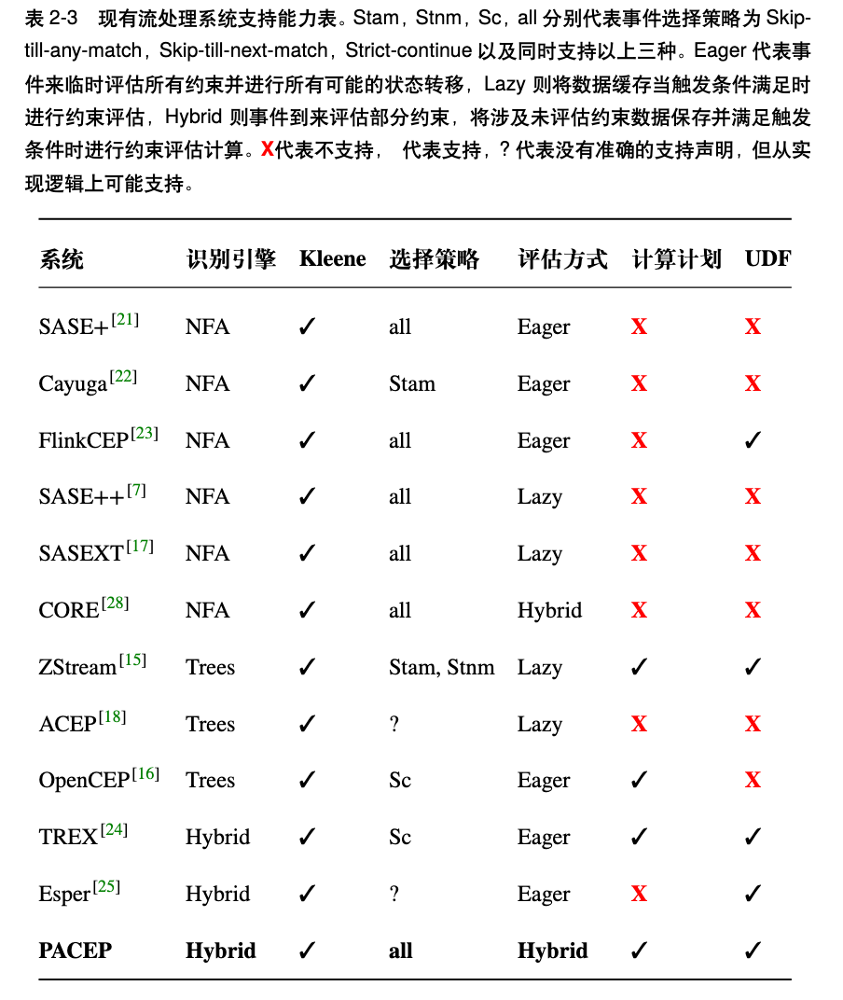

<div align="center">
  
  <h1>Postpone Accelerate Complex Event Processing</h1>
</div>

[English Documentation](README.md) | [简体中文](README.zh.md)

Postpone Accelerate Complex Event Processing（𝑃𝐴𝐶𝐸𝑃 ）是一种基于自动机与树模型相结合的混合两阶段识别引擎，用于解决传统方法在多 Kleene 闭包场景下同时面临状态空间爆炸和约束评估低效的问题。

# 简介

复杂事件识别（Complex Event Recognition, CER）是一种从实时数据流中提取符合领域专家定义模式的事件序列的技术。在领域知识指导下，CER系统通过语义模式的定义与匹配实现对关键事件序列的提取操作，这些模式往往集合了类型约束、时序特性及谓词限制等多种规范要素。
随着物联网的快速发展和传感器的广泛部署，流处理引擎在实时风险识别场景中能够高效地接收全面且低延迟的实时数据流。借助领域专家定义的模式，流处理引擎能够识别并输出符合高风险事件标准的事件序列。例如，在海事安全和医疗保健系统中，能够及时捕获潜在的危险事件序列，为相关机构制定应急响应措施提供可靠依据。危险事件的发展通常呈现阶段性特征，每一阶段可能由单一瞬时事件或多个瞬时事件组成的区间事件构成。由瞬时事件构成的阶段只需要判断瞬时事件的类型和值是否满足模式定义，而区间事件的识别由于其开始时间、结束时间和持续时间的不确定性，使得模式评估的计算代价随着相关类型事件的增加呈多项式甚至指数型增长。 

## 经典案例
### 人为操作的股价闪电崩盘
在现代金融领域，闪电崩盘是指证券价格在极短时间内迅速、深度和波动性下跌，然后迅速恢复。人为操控闪电崩盘的情况通常发生在某些市场参与者通过"闪电攻击等手段故意引发市场恐慌。例如，操纵者可能通过大量的虚假订单（如“虚假报价”或“冰山订单”）在短时间内制造出市场供求的假象，从而引发价格波动。这种操控手段会导致其他投资者误判市场情形，进而撤回流动性，进一步加剧市场崩盘。

```sql
PATTERN SEQ(a+, b, c)
        SEMATIC skip_till_any_match
        WHERE a.type = 'close'
        AND msd_exceeds_variance_threshold(a) >= 0.1
        AND b.type = 'high'
        AND b.value - min(a) < 0
        AND c.type = 'low'
        AND c.value - 0.9 * b.value <= 0
        AND c.value - max(a) >= 0
        WITHIN 7 days 
```

### Hadoop 集群的异常负载
集群计算在大数据分析中已广泛应用，监控计算集群（如Hadoop集群）对于理解性能问题和有效管理资源变得尤为重要。流行的集群监控工具，如Ganglia ，提供有关CPU、内存和I/O的系统度量信息，这些信息来源于外部用户程序。然而，随着需求的增加，需要将这些系统度量与工作负载特定的日志（如Hadoop任务的开始、进度和结束）关联起来，以便识别不平衡的工作负载、任务滞后、数据排队等问题，手动编写程序完成这些任务既繁琐又难以重用。在识别在分布式集群中导致负载不平衡的Reducer的场景中，能够以声明性模式查询来表达监控需求，成为解放用户免于手动编程的关键。此外，许多监控查询需要关联一系列事件（使用上文定义的Kleene闭包），这些事件可能分布在来自不同机器的单个或多个追踪中。在大量系统追踪数据生成的情况下，处理这些查询对于实时集群监控至关重要。
```sql
PATTERN SEQ(a, b+, c)
        SEMATIC skip_till_any_match
        WHERE a.type = 'reducer_start'
        AND b.type = 'load_std'
        AND b[i].value - b[i-1].value >= 0
        AND c.type = 'reducer_end'
        WITHIN 10 minutes 
```

### 股票上升相关性的识别
在金融市场分析中，股票之间的相关性研究为投资者提供了有价值的决策依据。特别是在同一行业内，企业之间的股价往往呈现出一定的关联性。例如，微软（MSFT）和谷歌（GOOG）作为全球知名的科技公司，其股价变动通常受相似的市场因素影响，如行业趋势、政策变化和经济周期等。
```sql
PATTERN SEQ(a+, b+)
        SEMATIC skip_till_any_match
        WHERE a.type = 'goog'
        AND a[i].value - a[i-1].value >= 0
        AND last(a) - 1.1 * first(a) >= 0
        AND b.type = 'msft'
        AND b[i].value - b[i-1].value >= 0
        AND last(b).value / first(b).value >= last(a).value  
            / first(a).value 
        WITHIN 7 days
```

### LNG-Rollover 检测
例如，LNG-Rollover 是一种发生在储罐内两种或更多不同成分的液化天然气（LNG）之间的物理混合过程。通过检测蒸发率、分层页面之间的密度差、罐柜压力等事件变化趋势，可以提前检测可能导致严重后果的 LNG Rollover 事件。例如，图 1-1 描述了 LNG Rollover 的四个阶段，其中第二阶段可以通过识别蒸发率快速变化趋势 A 事件，然后接连发生相邻两层密度差减小事件趋势 B 事件，提前捕获 LNG Rollover 发生的充分前兆信息。然而，并非所有的 LNG Rollover 事件都需要关注。如图 1-2 所示，Rollover 1 和 Rollover 2 并未造成严重后果，而只有 Rollover 3 和 Rollover 4 因为压力超过罐柜安全范围，且随时间快速发展并引发严重后果的事件才需要发出警报。事件 C 代表罐队内压力超过安全阈值。
<div align="center">
  
   
</div>


```sql
PATTERN SEQ(A+, B+, C)
        SEMATIC skip_till_any_match
        WHERE A.type = 'boil_off_rate'
        AND standard_deviation(A) / avg(A) >= 1.1 -- 蒸发率急剧变化
        AND A.type = 'density_diffrence'
        AND B[i].value - B[i-1].value < 0 -- 密度差下降
        AND C.type = 'tank_pressure'
        AND C.value >= 250 -- 压力超过罐柜安全阈值
        WITHIN max_time
```

## 工作原理
### 解决状态空间爆炸
针对Kleene 闭包算子展开造成的状态空间爆炸，导致事件处理延迟陡增的问题，本文通过将仅Kleene 状态不同的中间匹配结果合并，生成满足所有解集的最小覆盖集，进而控制中间匹配结果的数量以降低事件对逻辑语意上等价的中间匹配结果的冗余更新。本文通过将模式拆分为Kleene 事件和普通事件的四类聚和结果，从数学推论上证明了逻辑等价类能在不丢失任何可能事件组合的前提下，将中间匹配结果的状态空间复杂度从指数级低为多项式级别。

### 解决约束评估低效
针对约束评估低效的问题，𝑃𝐴𝐶𝐸𝑃 通过重写模式规则，将需要涉及Kleene 事件展开后组合的约束剥离，将模式分解为基础模式解识别和模式基础解展开构建最终结果两个阶段。在基础模式识别阶段，利用基础模式在事件流中锚定时间可能发生的时间区间和事件组合。在模式展开计算阶段，所有本来按时间顺序流未知的Kleene 状态能捕获的事件组合变已知，此时可以大致估算不同约束的计算代价，基于模式计算代价查询计划，利用低代价约束提前将不满足的模式基础解进行剪枝，从而减少不必要解。在减少冗余计算方面，通过在Kleene 事件的展开过程中构建伪表存储每个中间状态的组合和运算结果，确保在模式基础解上Kleene 状态中捕获的事件仅进行一次组合和相同函数仅进行一次运算（combination and computation once, cc-once）。

## 实验效果
### 相关工作
我们从流处理引擎的类型（Engine）、事件选择策略支持能力（Selection Policy, S.P.）、约束评估方式（Evaluation, EV）、约束评估顺序的制定能力（Evaluation Plan, E.P.），以及是否支持用户自定义函数（UDF）等方面，分析了当前主流系统的特点，具体内容见表2-3。Kleene 状态用于捕获时间上有界但数量上无限的子事件序列。流处理引擎的类型决定了如何根据模式从实时数据流中捕获符合模式定义的事件序列；事件选择策略则定义了在当前事件符合或不符合捕获条件时，流处理引擎采取的行动；约束评估方式决定了事件到达时是否立即计算相关约束条件；计算计划则在评估过程中通过制定与原模式定义的时序关系不同的约束评估顺序，从而优化整体识别效率。尽管现有系统在一定程度上支持 Kleene 事件的识别和相关约束的评估，但总体来看，现有方案尚未能有效地结合事件读取时的时序关系与约束计算之间的交互，导致冗余计算较多且剪枝效率不高。为了提高系统性能，需要进一步优化事件时序与约束评估之间的协同工作，从而减少不必要的计算开销并提高模式匹配的效率。
<div align="center">
  
</div>

### 实验结果
通过比较在真实数据集和仿真数据集上识别包含Kleene 事件的模式，验证 𝑃𝐴𝐶𝐸𝑃 较于𝐹𝐿𝐼𝑁𝐾𝐶𝐸𝑃、𝐶𝑂𝑅𝐸、𝐶𝐸𝑇、𝑆𝐴𝑆𝐸 在各种事件采集频率和事件发生频率下的处理时间的降低。实验结果表明，𝑃𝐴𝐶𝐸𝑃 在所有场景下的事件处理时间较CORE 减少了三倍以上，相较于本文中基于𝑁𝐹𝐴𝑏 未经延迟处理优化的方法，模式基础解可以看作流数据上的锚点事件，其性能在锚点事件能有效捕获事件发生区间的情况下，系统吞吐量在窗口大小为50 时仍能保持1000eps足，且吞吐量随着窗口大小呈指数型降低。

-[Compare with CORE/SASE/CET] (https://github.com/KyraStyl/SASEXT)

-[Compare with FLINKCEP] (https://github.com/LiLiJacky/PACEP_FLINKCEP)

## Conclusion
PACEP 确保自动机识别阶段的中间匹配数量在最坏情况下为多项式时间复杂度的条件下实现模式基础解的识别，在延迟计算阶段从不同层级上减少冗余计算。针对约束计算可增量计算的情况，PACEP 还支持用户自定义函数，以加速约束评估过程。

# 如何运行代码
1. 安装依赖
```python
pip install -r requirements.txt
```
2. 在 ./factories 中注册需要的用户自定义函数
3. 编写模式查询脚本，例如 ./experiments/effective/lng_rollover.py
4. 运行脚本
```python
python ./lng_rollover.py
```
5. 查看 ./outputs 中的结果

# Acknowledgements
This work is supported by Projects of International Cooperation and Exchanges NSFC-DFG (Grant No. 62061136006).